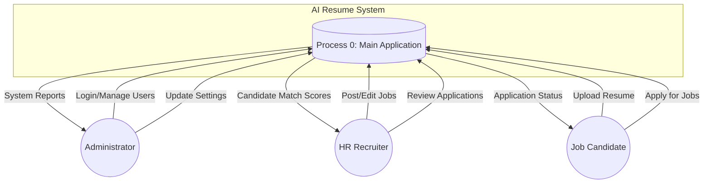
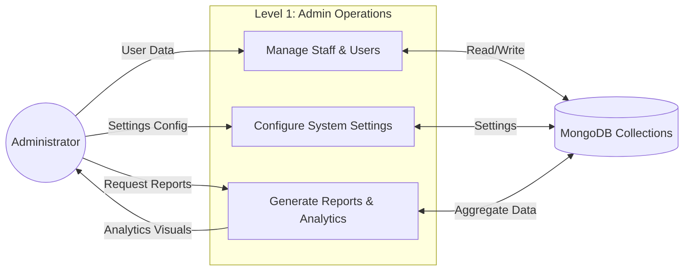
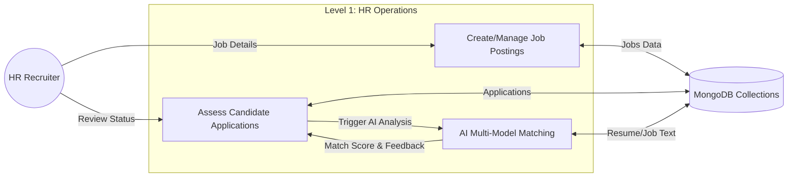
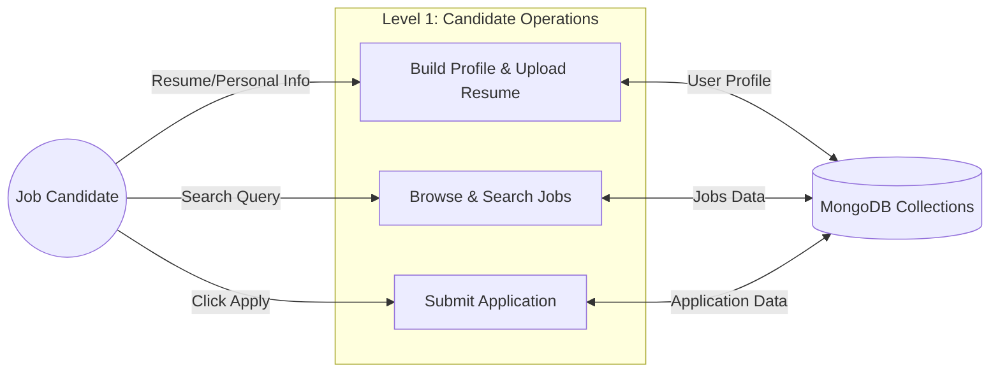

# Data Flow Diagrams (DFD)

This document outlines the flow of information through the AI Resume System at different levels and for different roles.

---

## 1. DFD Level 0: Context Diagram

The Level 0 diagram shows the system as a single process and its interactions with external entities (Admin, HR, Candidate).

---

## 2. DFD Level 1: Administrator

Shows the internal processes managed by the Administrator.

---

## 3. DFD Level 1: HR Recruiter

Shows the workflow for managing job postings and evaluating candidates.

---

## 4. DFD Level 1: Job Candidate

Shows the candidate experience from profile setup to job application.

