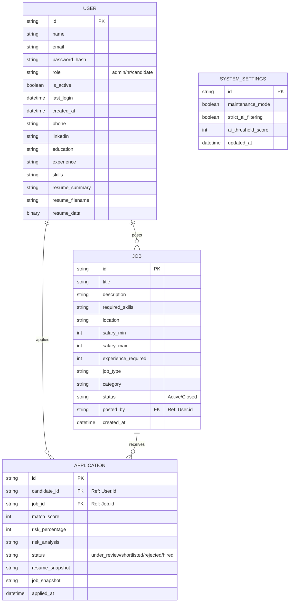

# Entity-Relationship (ER) Diagram

This diagram visualizes the relationships between the different collections in the MongoDB database.

### Relationship Summary:

- **User to Job**: 1:N relationship. A user with the `hr` role can post multiple jobs.
- **User to Application**: 1:N relationship. A user with the `candidate` role can submit multiple applications across different jobs.
- **Job to Application**: 1:N relationship. Each job posting can receive multiple candidate applications.
- **SystemSettings**: A singleton configuration document that manages global app behavior.
